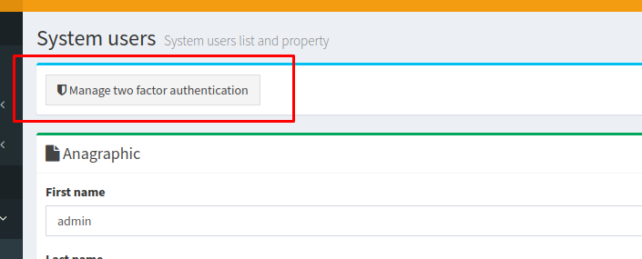
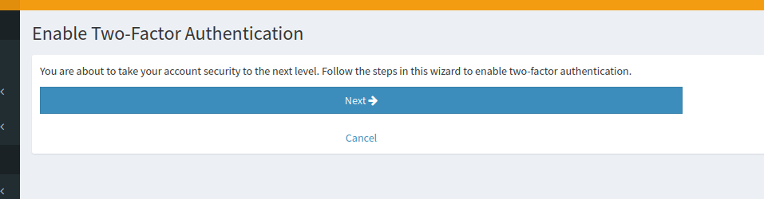
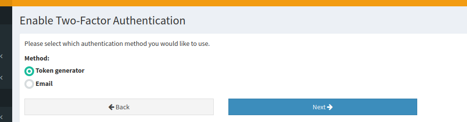
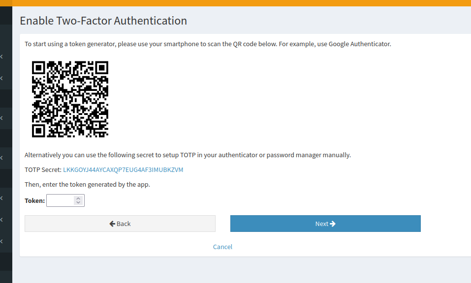
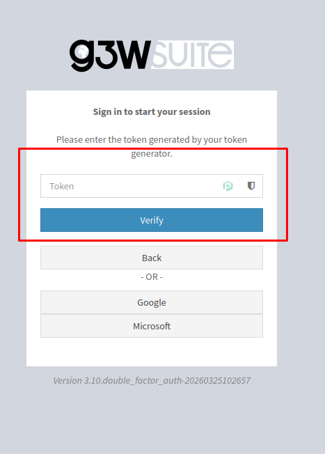

# Double Factor Authentication (2FA)

**G3W-SUITE** supports standard login plus optional two-factor authentication (2FA).  
When 2FA is enabled for a user, authentication is completed in two steps:

1. Username/password validation
2. One-time token verification

## Configuration-Driven Behavior

- Two-factor authentication is enabled through the application setting `ENABLE_TWO_FACTOR_AUTH` (default is False).
- If Django email is configured (`EMAIL_HOST` is set) and 2FA is enabled is possible receive the token by email.

### Accessing 2FA Management

From the **User Profile** page, users can open **Manage two factor authentication**.  
This entry point is available for existing users and starts the 2FA setup wizard.

### 2FA Setup Wizard

The setup process is guided and split into sequential steps:

1. **Introduction step**  
   The wizard explains that enabling 2FA increases account security.

2. **Method selection**  
   The user chooses the second-factor method:
   - Token generator (TOTP)
   - Email
  

3. **Token generator configuration (TOTP)**  
   If TOTP is selected, the wizard provides:
   - A QR code for authenticator apps
   - A fallback secret key for manual setup
   - A token input field to confirm activation

After entering a valid token, 2FA is linked to the account.

### Login Flow with 2FA Enabled

When a user with active 2FA signs in:

- The system prompts for a verification token after primary credential validation
- The user enters the current code generated by the authenticator app
- Successful verification completes login

The login view also keeps alternative navigation and configured external provider options visible.

